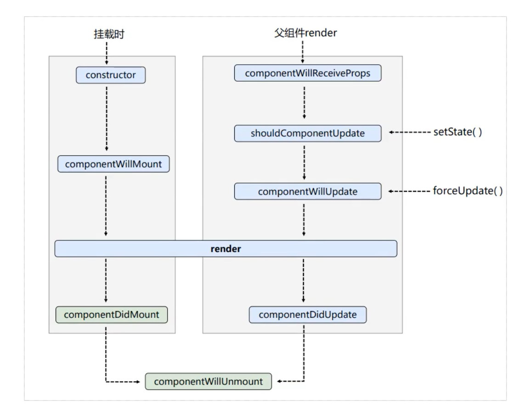
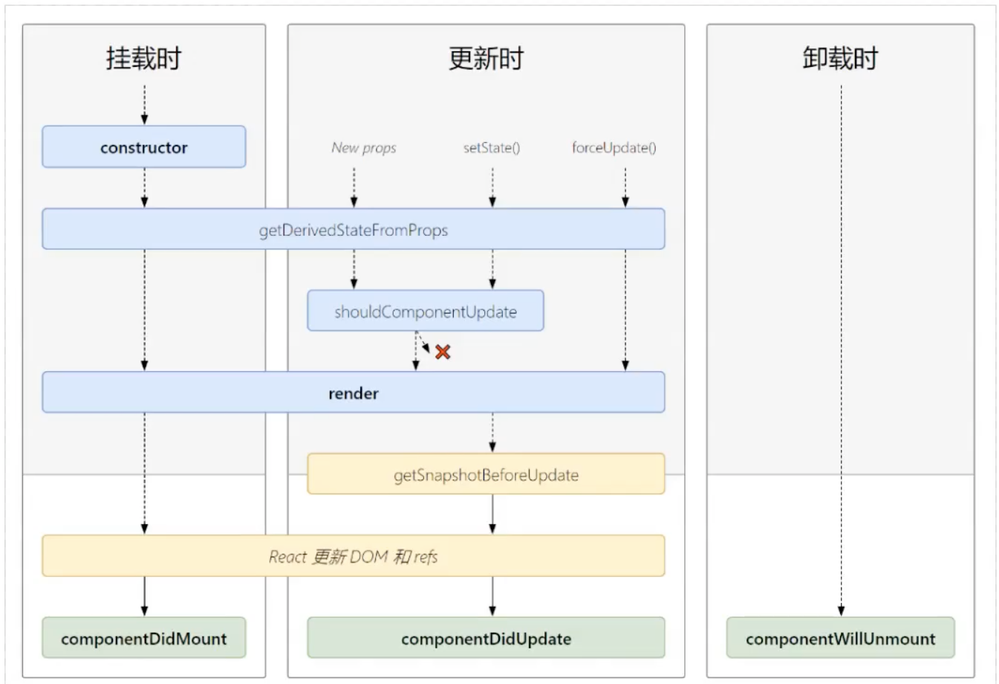

# React 旧生命周期笔记（2021）

> 归档原因：本文以 `componentWillMount`、`componentWillReceiveProps`
> 和 `componentWillUpdate` 等旧生命周期为主，不适合当作当前 React 实践。
> 仅用于阅读历史类组件；当前内容见
> [组件生命周期与 Effect](../05-React生态/组件生命周期与Effect.md)。

## 16

#### 挂载卸载过程

##### constructor()

完成了 React 数据的初始化，接收两个参数：props 和 context

##### componentWillMount()

componentWillMount()一般用的比较少，它更多的是在服务端渲染时使用。它代表的过程是组件已经经历了 constructor()初始化数据后，但是还未渲染 DOM 时。

##### componentDIdMount()

组件第一次渲染完成，此时 dom 节点已经生成，可以在这里调用 ajax 请求，返回数据 setState 后组件会重新渲染

##### componentWillUnmount()

在此处完成组件的卸载和数据的销毁。

1. clear 你在组建中所有的 setTimeout,setInterval
2. 移除所有组建中的监听 removeEventListener

#### 更新过程

##### componentWillReceiveProps(nextProps)

在接受父组件改变后的 props 需要重新渲染组件时用到的比较多

接受一个参数 nextProps

通过对比 nextProps 和 this.props，将 nextProps 的 state 为当前组件的 state，从而重新渲染组件

##### shouldComponentUpdate(nextProps, nextState)

主要用于性能优化(部分更新)

唯一用于控制组件重新渲染的生命周期，由于在 react 中，setState 以后，state 发生变化，组件会进入重新渲染的流程，在这里 return false 可以阻止组件的更新

因为 react 父组件的重新渲染会导致其所有子组件的重新渲染，这个时候其实我们是不需要所有子组件都跟着重新渲染的，因此需要在子组件的该生命周期中做判断

##### componentWillUpdate(nextProps, nextState)

shouldComponentUpdate 返回 true 以后，组件进入重新渲染的流程，进入 componentWillUpdate,这里同样可以拿到 nextProps 和 nextState。

##### componentDIdUpdate(prevProps,prevState)

组件更新完毕后，react 只会在第一次初始化成功会进入 componentDIdMount,之后每次重新渲染后都会进入这个生命周期，这里可以拿到 prevProps 和 prevState，即更新前的 props 和 state。

##### render()

render 函数会插入 jsx 生成的 dom 结构，react 会生成一份虚拟 dom 树，在每一次组件更新时，在此 react 会通过其 diff 算法比较更新前后的新旧 DOM 树，比较以后，找到最小的有差异的 DOM 节点，并重新渲染

#### 总结

1. 初始化阶段：由 ReactDOM.render() 触发第一次渲染

   1. constructor

   2. componentWillMount

   3. render

   4. componentDidMount

      > 常用，做初始化的事，例如：开启定时器、发送网络请求、订阅消息

2. 更新阶段：由组件内部的 this.setState() 或 父组件 render 触发

   1. shouldComponentUpdate
   2. componentWillUpdate
   3. render
   4. componentDidUpdate

3. 卸载阶段：由 ReactDOM.unmountComponentAtNode() 触发

   1. componentWillUnmount

      > 常用，做收尾的事。例如：关闭定时器，取消订阅消息

## 17

#### 总结

1. 初始化阶段：由 ReactDOM.render() 触发第一次渲染

   1. constructor

   2. getDerivedStateFormProps

   3. render

   4. componentDidMount

      > 常用，做初始化的事，例如：开启定时器、发送网络请求、订阅消息

2. 更新阶段：由组件内部的 this.setState() 或 父组件 render 触发

   1. getDerivedStateFormProps
   2. shouldComponentUpdate
   3. render
   4. getSnapshotBeforeUpdate
   5. componentDidUpdate

3. 卸载阶段：由 ReactDOM.unmountComponentAtNode() 触发

   1. componentWillUnmount

      > 常用，做收尾的事。例如：关闭定时器，取消订阅消息

## 16 和 17 的区别

1. 废弃了 3 个 will 钩子
   1. componentWillMount
   2. componentWillReceiveProps
   3. componentWillUpdate
2. 新提出 2 个
   1. getDerivedStateFromProps
   2. getSnapshotBeforeUpdate
