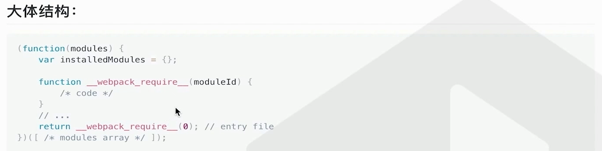
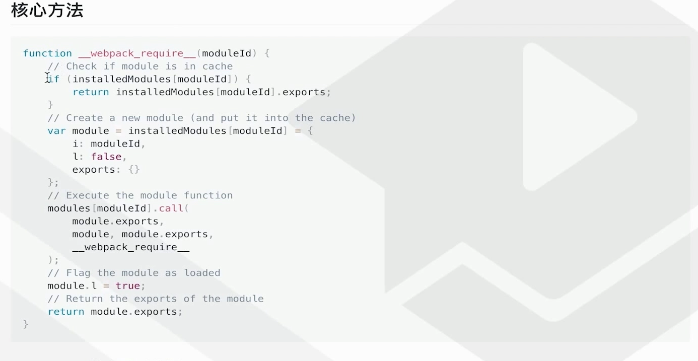
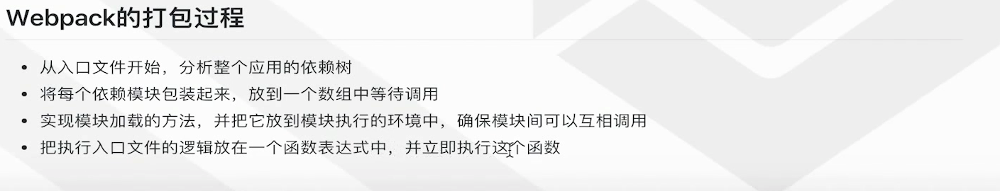

# Webpack 与 Gulp 旧稿（2021）

> 归档原因：本文以 Gulp、DLL、旧版 Webpack 优化为背景，
> 且原文存在“Webpack 适合 SPA、Gulp 适合多页”等过度简化结论。
> 当前构建原理见
> [Vite 与 Webpack](../07-工程化/Vite与Webpack.md)。

1. webpack 基于模块打包，gulp 基于任务流打包
2. webpack 适合 SAP 单页面开发，gulp 适合多页面应用开发

## Webpack 原理

### webpack 与立即执行函数的关系

### webpack 打包的核心逻辑

### 作用域

1. 运行时 - 变量 函数 对象 可访问性
2. 作用域决定了代码中变量和其他资源的可见性

### 模块化的优点

1. 作用域封装
2. 重用性
3. 解除耦合

### 优化

1. 多线程打包
2. exclude、include
3. 缓存
4. DCE

