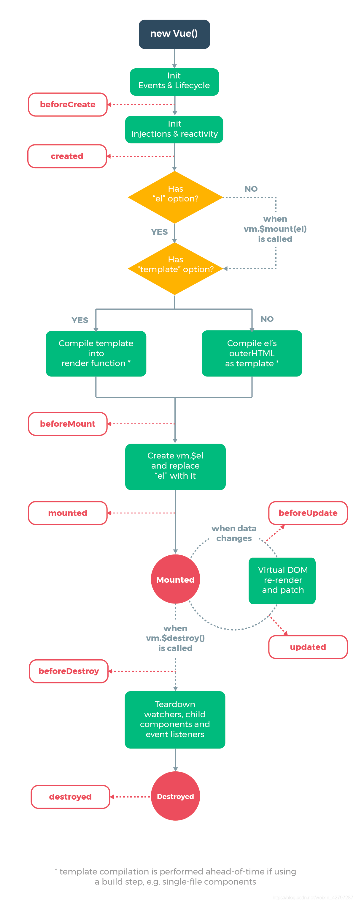

# vue 声明周期

## 系统自带
1. beforeCreate
2. created ($data)
3. beforeMount
4. mounted ($el)
5. beforeUpdate
6. updated
7. beforeDestroy
8. destroyed

## keep-alive 附带
1. activated
2. deactivated

### 进入带有 keep-alive 的页面执行的生命周期
1. 第一次进入
   1. beforeCreate
   2. created ($data)
   3. beforeMount
   4. mounted (dom)
   5. activated
2. 第二次进入
   1. activated

## Vue中组件生命周期调用顺序
1. 组件的调用顺序都是先父后子,渲染完成的顺序是先子后父。
2. 组件的销毁操作是先父后子，销毁完成的顺序是先子后父。

### 加载渲染过程
父beforeCreate
-> 父created
-> 父beforeMount
-> 子beforeCreate
-> 子created
-> 子beforeMount
-> 子mounted
-> 父mounted

### 子组件更新过程
父beforeUpdate->子beforeUpdate->子updated->父updated

### 父组件更新过程
父 beforeUpdate -> 父 updated

### 销毁过程
父beforeDestroy->子beforeDestroy->子destroyed->父destroyed
